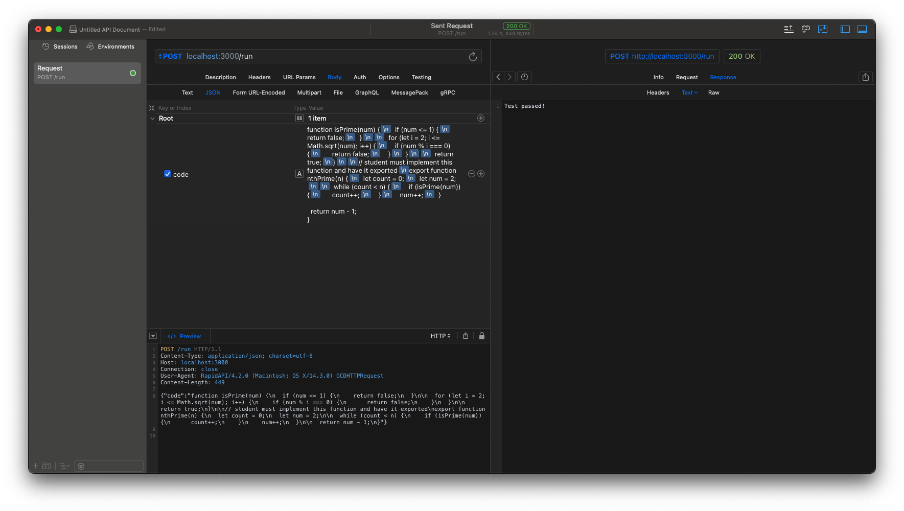

# CODE RUNNER
An MVP to demonstrate running student code securely in Docker containers and checking against a predefined result.

The web server exposes the `/stub` endpoint, where the code to complete is retrieved from.
More importantly, the `/run` endpoint is exposed, to which a user can post with a body that contains the "`code`" key and the code to run as the value.

When code is submitted, a container is built that contains the exercise framework, and the student's code. This is then executed, and the result is piped back into the Express server. Here, it is checked if the words "fail", "failed" or "error" are present. If not, the code is considered to have passed.

To define an exercise, you need to define how to initialize the exercise environment in the `init.Dockerfile`. Additionally, the `exercise.mjs` file needs to be defined, which is the logic that checks the result of the code. The `submissionstub.mjs` file is the file that contains the stub code that the user needs to complete.
The `student.Dockerfile` is the file that defines how the student code is injected into the container and run.

The App is run by executing `npm run dev` in the root directory.

This is a request that passes the currently provided sample exercise:
